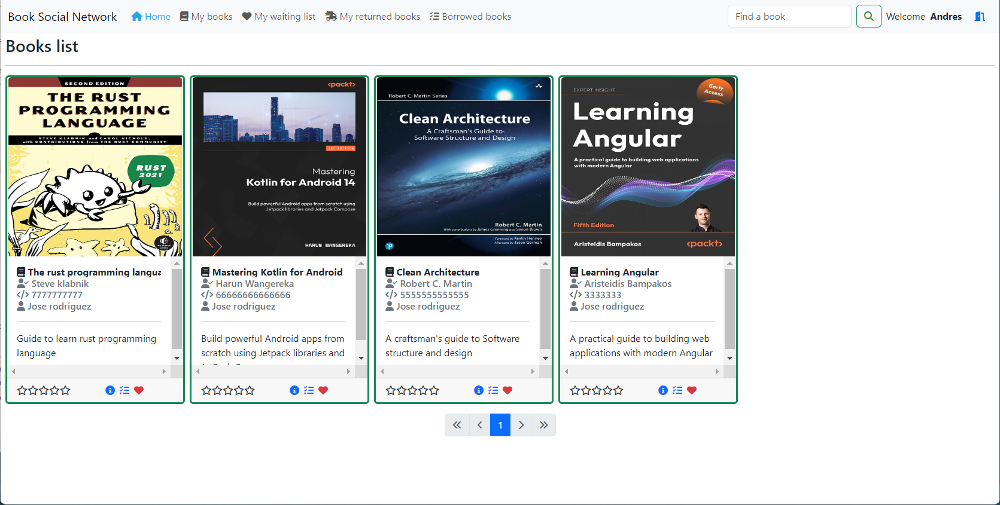
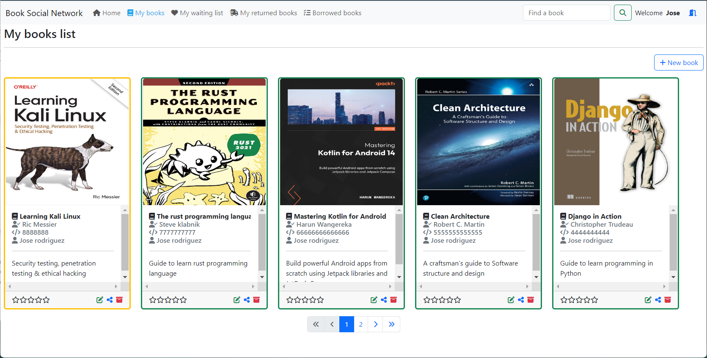
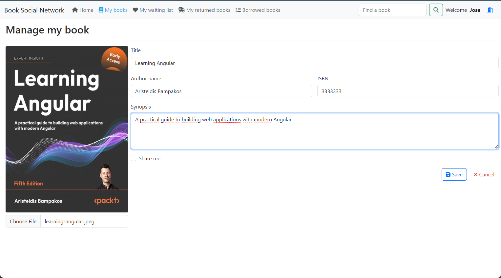
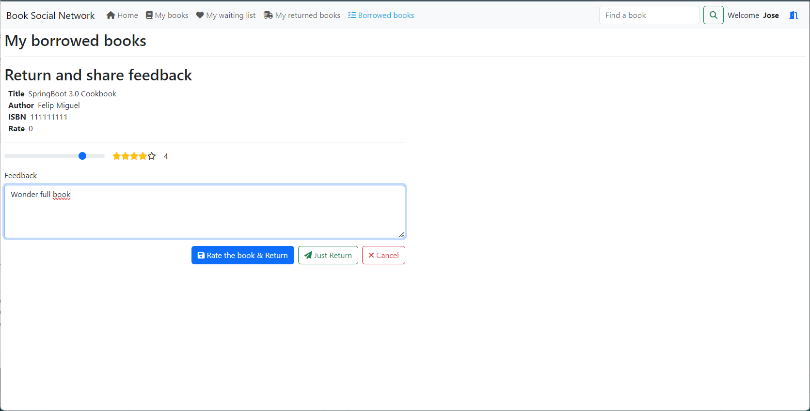
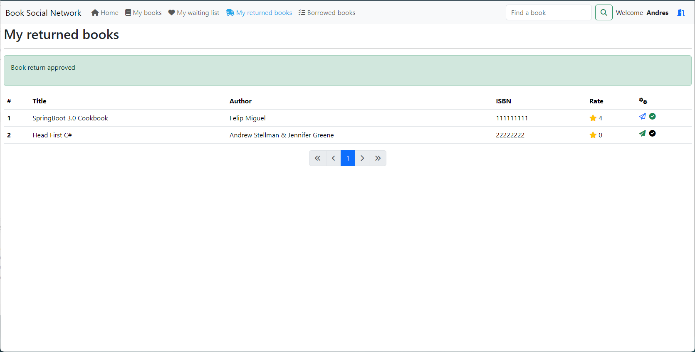
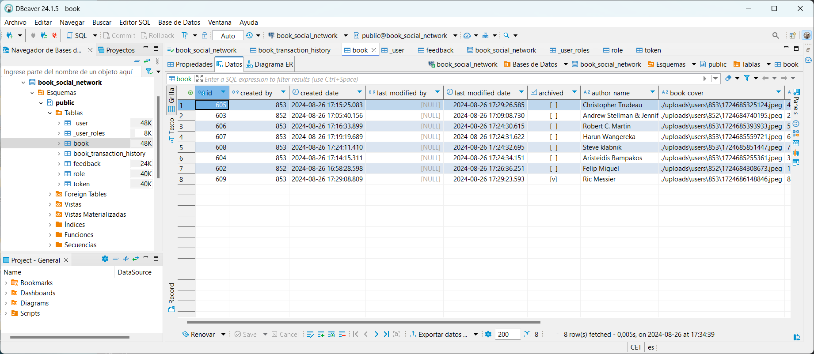

# Book Social Network

## Overview

Book Social Network is a full-stack application that enables users to manage their book collections and engage with a community of book enthusiasts. It offers features such as user registration, secure email validation, book management (including creation, updating, sharing, and archiving), book borrowing with checks for availability, book return functionality, and approval of book returns. The application ensures security using JWT tokens and adheres to best practices in REST API design. The backend is built with Spring Boot 3 and Spring Security 6, while the frontend is developed using Angular with Bootstrap for styling.

## Features

- User Registration: Users can register for a new account.
- Email Validation: Accounts are activated using secure email validation codes.
- User Authentication: Existing users can log in to their accounts securely.
- Book Management: Users can create, update, share, and archive their books.
- Book Borrowing: Implements necessary checks to determine if a book is borrowable.
- Book Returning: Users can return borrowed books.
- Book Return Approval: Functionality to approve book returns.

#### Images of the application

- Home page

- Books page

- My books page

- Create book page

- Give feedback book page

- Book return page


#### Class diagram


#### DB schema


#### Spring security diagram


#### Backend pipeline


#### Backend pipeline


## Technologies Used

### Backend (book-network)

- Spring Boot 3
- Spring Security 6
- JWT Token Authentication
- Spring Data JPA
- JSR-303 and Spring Validation
- OpenAPI and Swagger UI Documentation
- Docker
- GitHub Actions
- Keycloak

### Frontend (book-network-ui)

- Angular
- Component-Based Architecture
- Lazy Loading
- Authentication Guard
- OpenAPI Generator for Angular
- Bootstrap

## Docs API in Swagger UI

- [Swagger UI](http://localhost:8088/api/v1/swagger-ui/index.html)

## Dockerize the application

Note for full functionality, you need to modify application-dev.yml with username and password for the mail configuration.
username: your mail address
password: your apppassword in https://myaccount.google.com/apppasswords

- Run the following command to build the Docker image for the backend and start the application:

```bash
cd book-network
docker build -t bsn/bsn-api:1.0.0 -f ../docker/backend/Dockerfile . 
# docker build --build-arg="APP_VERSION=1.0.3" -t bsn/bsn-api:1.0.3 -f ../docker/backend/Dockerfile . (Alternative to include app version)
cd ..
docker compose up -d
```

- Run the following command to build the Docker image for the frontend and start the application:

```bash
cd book-network-ui
docker build -t bsn/bsn-ui:1.0.0 -f ../docker/frontend/Dockerfile .
cd ..
docker compose up -d
```

## Learning Objectives

By following this project, students will learn:

- Designing a class diagram from business requirements
- Implementing a mono repo approach
- Securing an application using JWT tokens with Spring Security
- Registering users and validating accounts via email
- Utilizing inheritance with Spring Data JPA
- Implementing the service layer and handling application exceptions
- Object validation using JSR-303 and Spring Validation
- Handling custom exceptions
- Implementing pagination and REST API best practices
- Using Spring Profiles for environment-specific configurations
- Documenting APIs using OpenAPI and Swagger UI
- Implementing business requirements and handling business exceptions
- Dockerizing the infrastructure
- CI/CD pipeline & deployment

## License

This project is licensed under the Apache License 2.0. See the [LICENSE](LICENSE) file for details.

## Contributors

- [Ali Bouali](https://github.com/ali-bouali)
